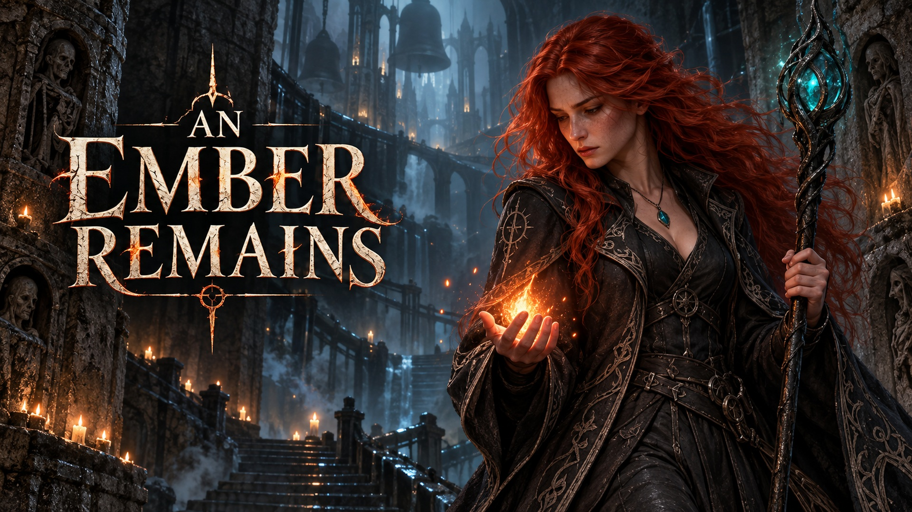

# An Ember Remains

[Download the latest Windows playtest](https://github.com/ATritle/AnEmberRemains/releases/tag/playtest-2026-10-08-opening)

October 8 downloadable build (local working-project snapshot): animated title flame, graphical menu, handwritten illustrated
prologue and staircase arrival; current dungeon combat, audio and contour HUD.
Extract the ZIP and run `Play-An-Ember-Remains.cmd`. Unreal Editor is not required.

[Download Mara walk, run and spell preview (MP4)](Media/Mara-Walk-Run-Spells.mp4?raw=true) ·
[Preview chapters and details](Media/Mara-Preview.txt) ·
[Split-robe motion study (download HTML and open locally)](ArtSource/MaraVey/v2/Motion-review.html?raw=true)

*For nine nights, a dead woman has been speaking through the ashes of her own
funeral pyre. On the tenth, her sister answers.*

A dark-magic isometric dungeon crawler. Mara Vey descends into the Crucible to
free her sister Elin before the Great Kindling consumes the captive souls below
the cathedral. [Story](Design/Story.md) · [First-floor design](Design/HushedCloisters.md)

Independent UE 5.8 project; no dependency on The Beard and Blade installation,
campaign or release history. Version track: `0.1.0-dev`. The current development playtest is linked above. No numbered game release
is published yet. Mara Vey's first eight-direction staff-caster animation set is
now playable; the original adventurer textures remain saved, not overwritten.

Current scope: art-dressed Hushed Cloisters, continuous isometric navigation,
smooth camera, explored map, room identities and a basic cinder-projectile input
prototype. Limestone floors and walls, corridor arches, burial/relic/infirmary
props, flickering candle light, drifting mist and foreground occlusion fading
are included. Dressing has collision and is rejected if it disconnects a route.
Five Hushed Cloisters enemy types now populate the combat playtest. Mara's first-pass sprites
include idle/breathing, walk, run, dodge, roll, and staff cast: 288 frames across
eight directions. This is an animation playtest, not a final polished character
release. Six prototype spell abilities are playable; other regions and bosses
remain pending.
Blue-green bolts release on cast frame four. Alt dodges; Space now phases through
blue mist (the roll artwork remains archived). Phase travels at twice its original
speed for 0.4025 seconds, covering approximately 3.18 grid units (15% farther),
with swept collision preventing
wall/prop bypass. It grants damage immunity only while active, with departure and
arrival mist puffs and an upright blue body afterimage. Alt dodge has no immunity.
Travel is frame-rate independent; the existing 1.05-second repeat cooldown remains.
Mara's in-game silhouette uses natural width and a modest 6% height adjustment, with ground anchors intact. Cast-crystal offsets follow the same proportions. The earlier 18% height / 8% width squeeze was reduced after visual review.
Source artwork, crop metadata and built-in image-generation prompts are preserved
in `ArtSource/MaraVey/v1`. `Tools/repack_mara.py` isolates connected figures and
their antialiased edges into padded atlases in `ArtSource/MaraVey/v1/Clean`.
Retained pixels are copied without resampling; original source sheets stay intact.
`Tools/import_mara.py` imports the cleaned atlases. An animated contact-sheet
preview is saved as `ArtSource/MaraVey/v1/Clean/Animation-review.gif`.

Exploration revision: rooms have a 10-cell minimum dimension, corridors are
five cells wide, and arch artwork spans the wider thresholds. Foreground walls,
arches and furnishings fade when their projected silhouettes cover the player.
Arch artwork is currently hidden, not deleted. An explored-only isometric minimap
is visible at the top right; M still opens the large map. The overlay is circular,
player-centred, clipped to a translucent bronze rim, and contains no labels.
A pale directional arrow marks the player; red diamonds mark living enemies
within 11 world units only when their explored cell is currently in line of sight.
Encounters progress from penitent groups to melee wardens, ranged acolytes, heavy armor and one rare elite.
Ambient life pass: room-specific ash, mud, stained linen, shallow puddles with
drips/ripples, damp wall streaks, Vigil banners, rusty vents and restraints.
Small rats wander and flee from nearby players; these are cosmetic, not enemies.
E inspects abandoned belongings, records, restraints and urns when nearby;
E/Esc closes the optional story panel. Environment art and generation prompts
are preserved in [Life artwork](ArtSource/Cloisters/LIFE-PROMPTS.md).
Clues now use four illustrated, handwritten parchment pages instead of plain
text panels: [note art and prompt](ArtSource/Cloisters/NOTES-PROMPT.md).
Large tombs, cabinets and cots are inset three cells from room boundaries and
reserve a 3x3 placement clearance, with route connectivity checked after placement.
Coffins use a separate tight, offset stone-base collision footprint, so that
placement clearance no longer keeps the player artificially far from the artwork.
Wall fading now requires
both foreground depth and projected overlap with the character, so rear and side
walls remain opaque. Recessed stairs now connect successive same-theme floors.
Camera scale remains unchanged to retain the wider view. `-ReviewNearWall`
positions an automated screenshot check beside an entrance-room foreground wall.

Underground lighting: darker cool ambient fill, warm occlusion-tested candle
lighting on stone, stronger asynchronous flame flicker, scattering halos, dust
and low fog. These are layered 2D lighting effects, not UE world-volume fog.
Defeat the floor's Vigil Justiciar to break the stone coffer's seal. The coffer
slides aside to reveal the recessed stairwell; its map marker and E-to-descend
prompt appear when the movement finishes. Approach the first step to descend.
The stone surround, coffer and open pit block normal movement;
the prompt and interaction share the same entrance-only trigger.
The adventurer walks/fades down, then a new seeded Hushed Cloisters floor loads;
depth increases, health carries over and exploration resets for the new floor.
This is forward-only procedural floor progression, not a completed boss campaign
or save system. R resets the exploration test to depth 1 with a new layout.
Stair art and prompt: [Stairwell](ArtSource/Cloisters/STAIRS-PROMPT.md).

Artwork generation prompts and provenance: [Cloisters assets](ArtSource/Cloisters/PROMPTS.md).

Build the AnEmberRemainsEditor target, then use Play-An-Ember-Remains.cmd (requires
UE 5.8). Left-click explored ground to move around obstacles; WASD remains available.
Shift: sprint; Shift + LMB: cast without moving; 1-6: spells; Space: phase toward
the cursor (or held movement direction); M: map; Esc: pause;
R: new map/reset; E: inspect clues or descend at the first step. `-IsoVerify` runs regression
tests; `-IsoReview` captures the environment. `-ReviewRoom=N` starts a visual check
in a particular room. User data is separate from the old game.

## Current spell test

| Input | Ability |
| --- | --- |
| Shift + LMB / 1 | Arcane Bolt from the staff crystal |
| Hold 2 | Flamethrower with animated flame tongues and dark smoke |
| 3 | Protective Ice Ring; press again to shatter |
| Hold 4 | Lightning channel |
| 5 | Frost Nova: nearby damage and a brief slow |
| 6 | Mend |

The ice ring grows from layered fractured chunks and protects Mara for six
seconds while she remains inside its safe core. Frost Nova deals 45 damage
within 3.2 grid units (line of sight required) and slows by 55% for 2.5 seconds.
Spell effects use Niagara with translucent flipbooks and procedural materials,
captured into the isometric renderer. Directional spells use measured staff-tip
anchors in eight directions. [Spell implementation notes](ArtSource/Spells/v2/README.txt)

[Actual gameplay preview (MP4)](Media/Spell-Preview-v2.mp4) ·
[Promotional artwork / icons](Media/Branding) ·
[Project handoff](Design/PROJECT_HANDOFF.txt)

The key art is promotional illustration, not a gameplay screenshot. The current
test contains five enemy types; combat values are prototypes, not final balance.

## Building and continuing development

Canonical local workspace: `C:\dev\An Ember Remains`. All source, assets and tools
are in this repository. It remains independent of The Beard and Blade.

Requirements: Unreal Engine 5.8, Visual Studio C++ build tools and Windows SDK.
Run `powershell -ExecutionPolicy Bypass -File Tools/package_cloisters.ps1` from
the repository. An optional `-EngineRoot` selects another UE installation.
The script builds/cooks a Win64 Shipping package into `Builds/HushedCloisters`.
`Play-Standalone.cmd` runs that package without requiring UE for the player.
`Play-An-Ember-Remains.cmd` is the editor-based alternative.

Generated builds/caches are not checked into Git. Copy the entire packaged
`Windows` folder to play elsewhere, not only its EXE. This push is a development
snapshot, not a numbered public game release.

Regression command: run the packaged Shipping EXE with
`-IsoVerify -nullrhi -nosound -unattended -UserDir=<absolute-QA-directory>`.
The October 8 revision passed 1,020,243 checks with zero errors. Visual review
includes all eight flamethrower directions and the six-spell in-game preview.

Branding masters and exact built-in image-generation prompts are preserved in
[ArtSource/Branding/v1](ArtSource/Branding/v1); export sizes and provenance are
listed in [ASSETS.txt](Media/Branding/ASSETS.txt). The Windows ICO is integrated
through `Build/Windows/Application.ico`. The title menu uses the original key art,
Niagara flame and graphical buttons. [Opening flow and controls](Design/Opening.txt).

Dungeon audio: footsteps and cloth movement, six spell sounds, sustained fire
and lightning, phase/dodge, interaction cues, and quiet dungeon/candle ambience.
F10 toggles sound. Map, lore and pause screens pause gameplay audio.
Credits and source licenses are in Audio-Credits.txt (also in the standalone
package); reproduction notes are in ArtSource/Audio/v1/README.txt.

## Enemy playtest

Five first-floor types now have idle, walk, attack, stagger, spawn and death
animations in eight directions (six frames per state, 1,440 frames total).
[Enemy roster and balance](Design/CloisterEnemies.md) ·
[Download the self-contained animation reviewer](Media/Cloister-Enemies-Preview.zip?raw=true).
Extract the ZIP and open its HTML in a browser to inspect actions, facings and individual frames.
Normal standalone play includes enemies; `-NoEnemies` restores quiet exploration.
The entrance remains safe. R restarts after defeat. This is the first combat/art pass.
